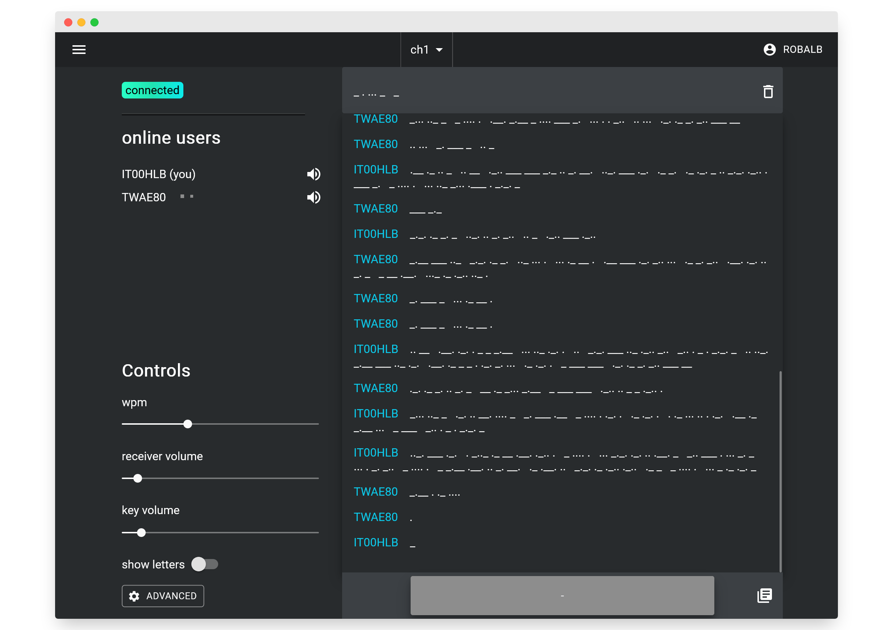
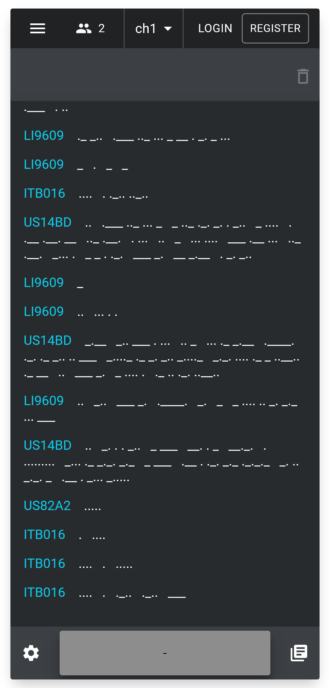

#  Morsechat 

Dünyanın her yerinden kullanıcıların morse kodunda pratik yapmasına ve pahalı ekipmanlara ihtiyaç duymadan iletişim kurmasına olanak tanıyan çevrimiçi bir morse kodu sohbeti. [morse.halb.it](https://morse.halb.it/) adresinde canlı

## ekran görüntüleri

<!--
w 600 200
h 500 400
-->

## yapılandırma

env.example dosyasını .env olarak kopyalayın

.env dosyasında uygulama gizli anahtarınızı yapılandırın

## geliştirme

bu depoyu klonlayın `git clone https://github.com/robalb/morsechat.git`

depo içine gidin `cd morsechat`

arka uç sunucusunu geliştirme modunda başlatın `cd backend && go run -race cmd/morsechat/main.go`

vite'i geliştirme modunda başlatın `cd web && npm run dev`

Bu adımlar uygulamanın yerel bir sürümünü çalıştırmak için yeterlidir.
Arka uç aynı zamanda birim, uçtan uca ve fuzz testleri de içerir, bunları `go test ./...` komutuyla çalıştırabilirsiniz

## üretim

Web uygulamasını bir üretim ortamında çalıştırmanın en kolay yolu sağlanan docker-compose.yml dosyasını kullanmaktır,
`docker-compose up --build`

Alternatif olarak, `kubernetes/base` dizinindeki bildirimleri kullanarak uygulamayı bir k8s kümesine dağıtabilirsiniz, ancak öncelikle
kendi traefik ingress kontrolcünüzü ve certmanager'ınızı kurmanız gerekecektir.
Arka uç web sunucusu, proxy protokolü etkinleştirilmiş bir ingress'ten gelen X-Forwarder-For başlıklarını işleyecek şekilde yapılandırılmıştır.
Bunu flaskapp.conf dosyasında yapılandırabilirsiniz

halb.it'teki canlı web sitesi github iş akışları kullanılarak oluşturulur ve argoCD ile bir k8s kümesine dağıtılır

